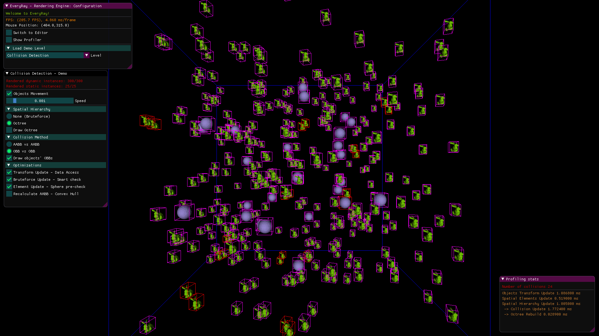

# EveryRay-Rendering-Engine
Rendering engine/framework written in C++/DirectX 11. 
https://youtu.be/_htQNxesr9U

!!!TEMP!!! At the moment only **"testScene"** and **"testScene_simple"** load correctly (other, like "sponzaScene", "terrainScene" are to be added). "testScene" contains GI support with light probes which are generated with the first launch (generating diffuse+specular probes and saving them on disk might take several minutes depending on your PC specs; in the future I will be adding pregenerated archives of probes for scenes to this repo). The second one has no probes assigned to the level, so you can use that scene if you do not need GI (its a very lightweight scene) 

# Some of the rendering features
- Deferred + Forward
- Local illumination w/ Physically Based Rendering
- Global illumination w/:
- - Static: Image Based Lighting (via light probes: diffuse/specular)
- - Dynamic: Cascaded Voxel Cone Tracing (AO, diffuse, specular)
- Cascaded Shadow Mapping
- Parallax-Occlusion Mapping w/ soft self-shadowing
- Separable Subsurface Scattering
- Terrain w/ GPU tessellation
- Foliage
- Volumetric clouds
- Post Processing: SSR, Motion Blur, Vignette, LUT color grading, FXAA, Tonemap, Bloom, Fog, Light Shafts

Other features based on NVIDIA techniques (no code provided here)
- Volumetric Lighting (from "Fast, Flexible, Physically-Based Volumetric Light Scattering")
- Ocean Simulation (from DX11 archive samples)

# Some of the engine features
- 3D model loading (.obj, .fbx and etc.) with Assimp Library
- Loading/saving to JSON scene files
- Simple objects editor
- AABB, OBB, collision detection
- ImGUI, ImGuizmo
 
# Screenshots

# Controls
- Mouse + Right Click - camera rotation
- WASD - camera side movement
- E/Q - camera up/down movement
- Backspace - enable editor
- R/T/Y - scale/translate/rotate object in the editor mode

# Notes
The framework is NOT API-agnostic and, thus, has been tighly bound to DX11 since the beginning of its development. Hopefully, I will be changing that in the future and adding DX12 support for it. It will undeniably improve the perfomance in many scenarios. 

You might increase TDR time of your GPU driver (explained here https://docs.substance3d.com/spdoc/gpu-drivers-crash-with-long-computations-128745489.html).

# External Dependencies
- DirectX Effects 11 (https://github.com/Microsoft/FX11)
- DirectXTK (https://github.com/Microsoft/DirectXTK)
- ImGui (https://github.com/ocornut/imgui)
- Assimp 5.0.1 (https://github.com/assimp/assimp)
- JsonCpp (https://github.com/open-source-parsers/jsoncpp/)

# References
- "Real-Time 3D Rendering with DirectX and HLSL: A Practical Guide to Graphics Programming" by Paul Varcholik.
- "Real-Time Rendering" 3rd/4th ed. by Tomas Möller, Naty Hoffman, Eric Haines
- "GPU Gems" series from NVIDIA
- "GPU Pro" series by Wolfgang Engel
- numerous SIGGRAPH, GDC papers and blogposts by fellow graphics geeks and vendors :)
 
# Requirements
- Visual Studio 2017
- Windows 10 + SDK
- DirectX 11 supported hardware
