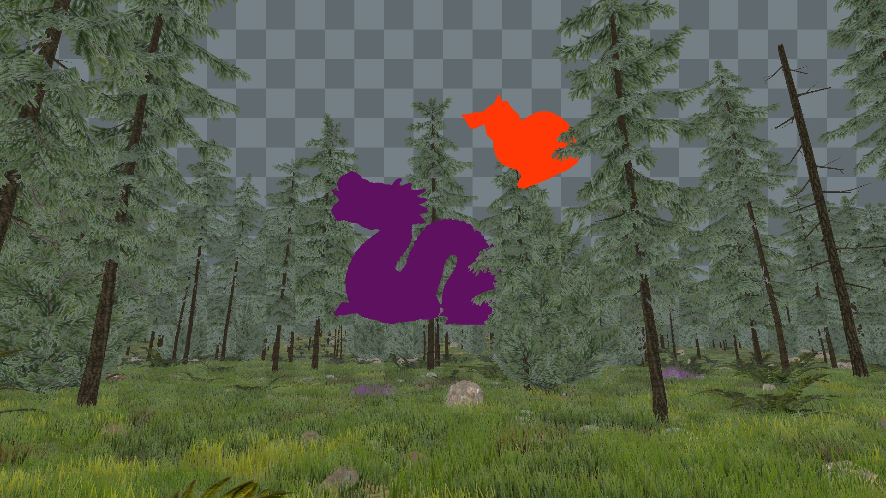
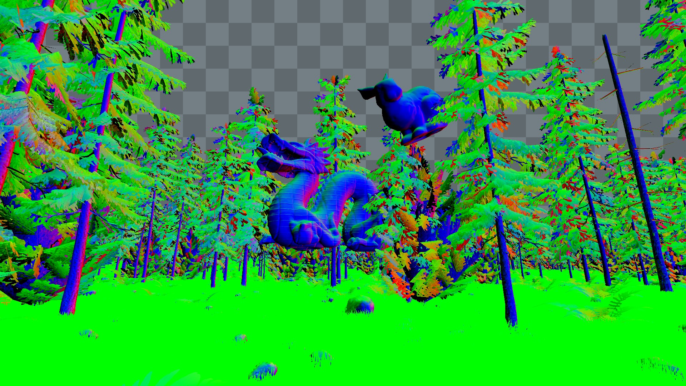
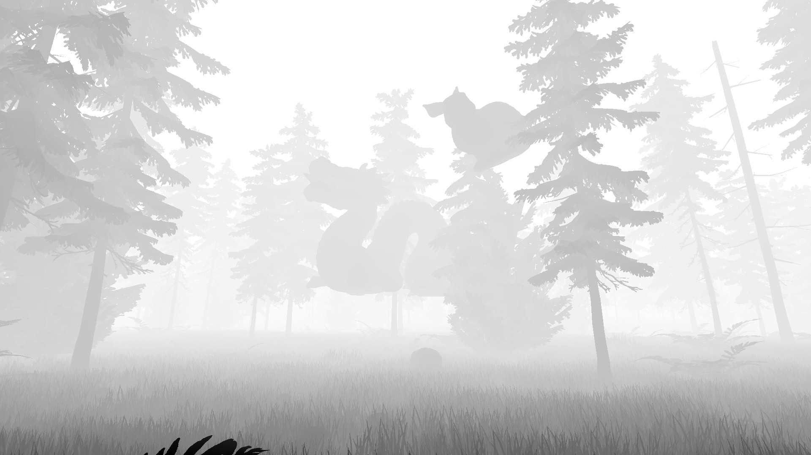
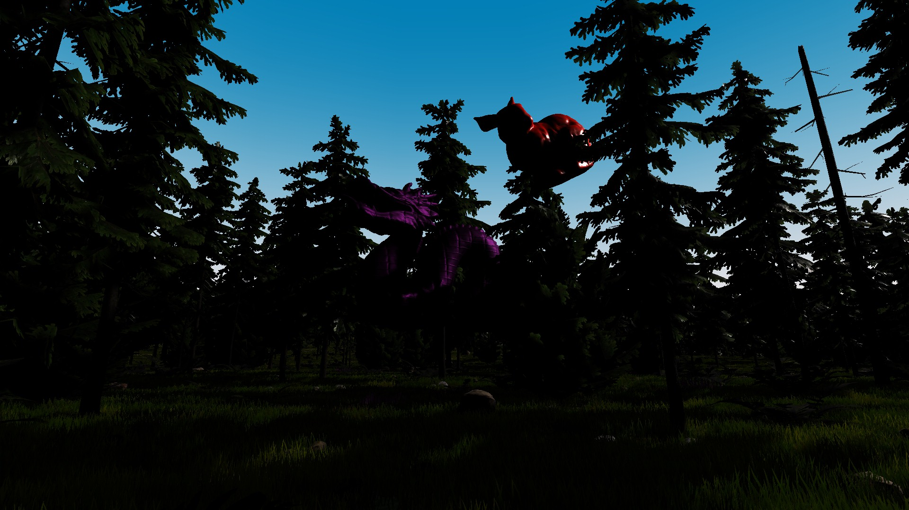
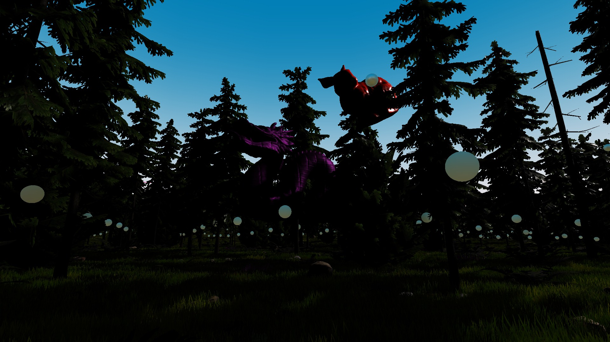
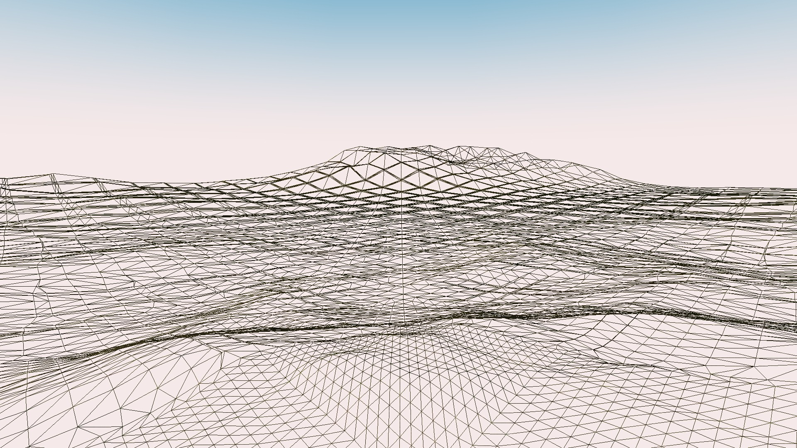
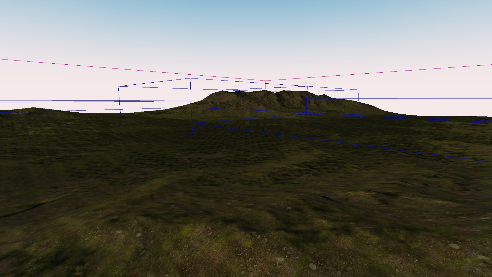
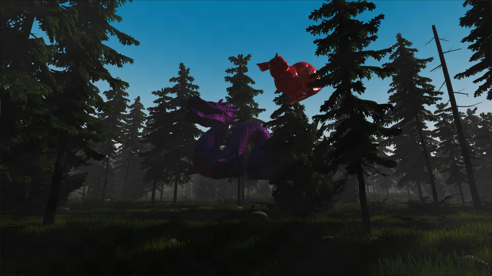
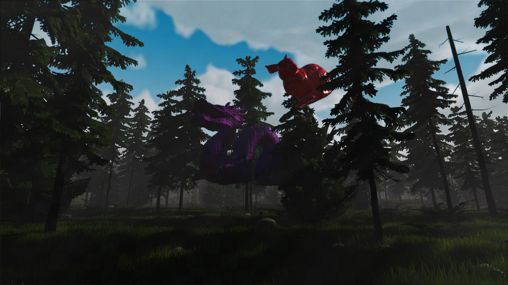

# Intro
This page gives a high-level overview of the most important graphics systems of _EveryRay_. It is written in a style of _frame analysis_ where an average frame of the engine is dissected from start to end into systems that are used for rendering the final image. This documentation does not require any advanced knowledge of graphics programming and attempts to cover complex systems in the simplest language possible (some sections might be re-worded or added with future updates).

_Note: Making any engine is hard and making it close to the current AAA engines is even harder. _EveryRay_ has been my multi-year hobby project outside a AAA job, which is why it is far (but not very far:) ) from what you normally see in a frame of modern engines/titles. The industry is always evolving, the implementations of systems are getting more complex and involved, and the optimizations are being performed just on a completely different level in comparison to hobby projects. But you have to start somewhere, right?! This page gives that starting point for those who are interested in AAA graphics and who want to learn how this particular engine attempts to render its frames in a "modern" way. Enjoy!_


Passes _(or their groups to be exact)_ in RenderDoc:
<p align="center">
 
</p>

# Frame - GPU culling
Our main goal is to render triangles that are formed from the vertices of ```ER_Mesh```es that are part of every ```ER_RenderingObject```. Doing that can be a bottleneck which is why we want to minimize the amount of unnecessary drawcalls in the engine as early as possible. Normally, this is achieved by _culling_ various data in the engine both on CPU and on GPU. Culling is a big topic which is still not ideal in _EveryRay_, however, some significant time has been invested into it.

Firstly, all ```ER_RenderingObject```s are CPU-culled against the camera view: everything outside the view frustum is ignored for the next passes. This works well for singular objects and simple scenes and can even work for instanced objects to some extent: traversing through all instances on CPU, culling (even with multi-threading) and then updating the instanced buffers on GPU with a readback to CPU can get really expensive for big number of instances. And if you add different LODs/meshes/objects, this gets even slower.

What we can do instead and what _EveryRay_ does is processing such objects indirectly on GPU without any CPU overhead. For now, it only works for static objects (so for dynamic prefer the method above) which have huge amount of instances (its not worth doing that for low count). In modern APIs it is possible to prepare instanced data on GPU (in other words, cull the instances in a compute shader) and then pass that info to the rendering passes with indirect draw commands of your API without any readbacks.  _Although its not yet implemented in _EveryRay_, but if your API supports indirect multi-draw command, you can even draw multiple different objects in one call!_

An example of indirect draw call for one of the meshes:
<p align="center">
 
</p>

In _EveryRay_ ```ER_GPUCuller``` is responsible for the process mentioned above: the system simply runs a GPU compute pass (```IndirectCulling.hlsl```) for every object where it frustum-culls its instances, prepares their LODs and writes everything in one GPU buffer for future processing in the frame. This already makes the workflow more efficient and modern for some scenarios than simple old-school CPU frustum culling.

Potentially, ```ER_GPUCuller``` can be extended for dealing with other data, such as foliage, lights per screen tile, voxels, etc. You can also be creative and combine the GPU culling passes asynchronously with rendering passes (such as shadows), re-use the results of a previous frame and do many other things which will be described here once implemented.

_Note: Although at this point we have only prepared the objects that are visible on screen, their triangles can be not fully visible (i.e. some might be outside the view or be overlapped by the triangles in front). This can also lead to significant wasted performance and, although geometry has never been a bottleneck in EveryRay so far, I still consider implementing a HiZ culling as an update to the system in the future._


# Frame - GBuffer

Since _EveryRay_ can use _deferred rendering_ (see "Direct Lighting"), we might need a set of GBuffers. ```ER_Gbuffer``` class finds all objects in the scene which have ```ER_GBufferMaterial``` assigned and renders them in several textures (```Gbuffer.hlsl```):
- Albedo
- Normals
- Extra target #1 (roughness, metalness, height, etc.)
- Extra target #2 ("RenderingObjectFlags" bitmasks)

_Note: So far I have not optimized any of the targets above for bandwidth. In theory, it is trivial to pack our data smarter (i.e. not waste unnecessary bits, reduce precision, pack normals into 2 instead of 3 channels, etc.) and perhaps those optimizations will come one day. A separate depth-prepass option is also considered for the future updates._





# Frame - Shadows

_Shadows rendering_ was one of the first systems implemented in _EveryRay_ which is why it has been carrying some legacy code and is far from perfect _(I have refactored parts of it though)_. 

In abstract, similarly to ```ER_GBuffer```, shadows are being handled in ```ER_ShadowMapper``` which finds objects with ```ER_ShadowMaterial``` and renders those into several depth targets, aka "shadow maps" (```ShadpowMap.hlsl```).

One of the cascades:

<p align="center">
 
</p>

For direct light source a classic _cascaded shadow mapping_ approach is used with ```NUM_SHADOW_CASCADES``` (by default equal to 3). For other sources there is nothing implemented yet, however, there is plenty of room for ideas: atlas-based approaches, dual-paraboloid mapping, static shadow mapping, etc.

```ER_ShadowMapper``` already provides some useful advancements: 2 ways of calculating projected matrix (bounding sphere or volume), texel-size increment updates (for fixing jittering), LOD-skipping, graphics quality presets (more in "Extra - Graphics config") etc.

# Frame - Illumination

Illumination is a complex subject that requires a certain level of creativity and compromise in real-time graphics. This section focuses on how we currently shade our pixels in _EveryRay_. 

To start with, let's divide our illumination into two big parts: _direct_ and _indirect_. On a high level, ```ER_Illumination``` aims to take care of both with the help of some additional systems described below. 

## Illumination - Direct Lighting
If we look at _direct_ lighting, there are a few key points to talk about.

Firstly, the engine uses both _deferred_ (```DeferredLighting.hlsl```) and _forward_ (```ForwardLighting.hlsl```) rendering paths which mostly share the same code from ```Lighting.hlsli```. Deferred rendering is done first and is used by default if the object has ```ER_GBufferMaterial``` assigned to it. Forward rendering is done after deferred and is used if ```ER_RenderingObject``` has one of the _standard_ materials assigned to it or has a set ```use_forward_shading``` flag in the scene file. Let's briefly talk about _materials_ in the engine. 

### Illumination - Direct Lighting - Materials
We can specify materials in a scene file for every ```ER_RenderingObject``` in the following way:

```json			
"new_materials" : 
[
	{
		"name" : "ShadowMapMaterial"
	},
	{
		"name" : "GBufferMaterial"
	},
	{
		"name" : "RenderToLightProbeMaterial"
	},
	{
		"name" : "VoxelizationMaterial"
	},
	{
		"name" : "FresnelOutlineMaterial"
	},
	{
		...
	}
],
```

Each of the materials has its class and is derived from ```ER_Material```. In _EveryRay_ there are _standard_ materials and a few _non-standard_ materials, such as ```ER_ShadowMapMaterial``` or ```ER_GBufferMaterial```. By _non-standard_ we mean materials that are processed in their bigger systems, such as ```ER_ShadowMapper``` or ```ER_GBuffer``` respectively. In other cases, materials are called _standard_ and do not need any processing outside their classes. Usually, _standard_ materials serve an artistic purpose, are rendered on top of each other (in the order they were assigned in the scene file), and are used for special features, such as _fur, snow, effects, transparency_ and everything that requires special shading models and shaders. 

_Note: The material system heavily relies on the C++ side of things which is not ideal and can be improved in the future. For example, it would be nice to make it more generic and artist-friendly by using scripting or JSON when declaring materials instead of creating separate ```.cpp/h``` files._

### Illumination - Direct Lighting - Shading

Our default shading model is _physically based_ (Cook-Torrance, GGX, Schlick from "Real Shading in Unreal Engine 4" by B. Karis) and is coded in the aforementioned ```Lighting.hlsli``` file. In general, if you want to modify something lighting-specific, it will be applied to both _forward_ and _deferred_ rendering paths. However, there are some edge cases, such as _parallax occlusion mapping_ ("Practical Parallax Occlusion Mapping For Highly Detailed Surface Rendering" by N. Tatarchuk) with soft self-shadowing which is for now only possible in _forward_.

The contributions from directional (```ER_DirectionalLight```) and non-directional light sources (```ER_PointLight```) are included in the total lighting, however, no optimizations have been made yet for the non-directional shading. It is a big topic but worth investigating once we want to support hundreds and thousands of light sources in a frame (_tiled deferred_ and _forward+_ techniques can be implemented to remedy that).

Direct-only result:


Finally, if we look at _indirect_ lighting (in order to complete our _global illumination_ of the scene), we should first divide it into 2 parts: _static_ and _dynamic_.

## Illumination - Static Indirect Lighting
_Static_ indirect lighting uses ```ER_LightProbe```s (for diffuse and specular) that capture radiance in defined points in space and are managed inside ```ER_LightProbeManager```. There are some interesting details to mention that are specific to _EveryRay_:
1) Every scene can have local light probes assigned either in a uniform 3D grid or 2D-scattered on top of the terrain's surface (if it exists in the scene). A user must specify the bounds (```light_probes_volume_bounds_min```, ```light_probes_volume_bounds_max```) and can specify a few other extra parameters, such as distances between probes of each type, etc.
2) If the scene has no probes assigned, a set of 2 global probes (diffuse and specular) is always generated for the level and is used as a fallback for _static_ lighting. Usually, it makes sense to include big objects (such as terrain, buildings, etc.) that contribute to the radiance in the global probes, which is possible to do with ```use_in_global_lightprobe_rendering``` field in the scene's file.
3) Probes (both local and global) are generated in the first frame if the user does not have probe data on disk in the root of the scene (```/diffuse_probes/``` and ```/specular_probes/```). Any object with ```ER_LightProbeMaterial``` assigned will be rendered to local probes (in _forward_-style) both in _diffuse_ (rendered to low-res cubemap, convoluted and encoded with _spherical harmonics_ and stored as text data) and in _specular_ (stored as 128x128 mipped cubemap ```.dds``` textures). Each file contains a probe's position in its name which makes it easier to debug and replace if needed: _if you delete the file, it will be regenerated upon the next launch of the scene_.
4) ```Lighting.hlsi``` also deals with retrieving data from the probes and applying it to the shading of the current pixel during ```DeferredLighting.hlsl``` or ```ForwardLighting.hlsl```. For _diffuse_ probes, we send a set of GPU buffers for probes _sperical harmonics_ coefficients, positions and _cells_ with probe indices (in the case of a 3D grid, a cell is 8 probes with each probe covering the space of a vertex in a uniform 3D volume). Then, during shading, a world-space position that we want to shade finds an appropriate _cell_ with a fast uniform grid approach and finally interpolates the radiance data from the neighbouring probes (in the case of a 3D grid, _trilinearly_). For _specular_ probes, we send a similar set of GPU buffers, but instead of interpolating, we just find the closest probe to our world position. If we have a lot of specular probes in the scene, it gets expensive to carry all of them in GPU memory, which is why we only keep several ones that are next to the camera and constantly unload/cull the ones that are far from the camera's current position (in the future it might be worth changing specular probes loading to _bindless_ resources in order to mitigate hardware limits).
5) The probe system does not support re-loading and updates during the frame, however, it might be extended for such purposes and modern ray-tracing pipelines.

Probes debug:


Direct + static indirect result:


## Illumination - Dynamic Indirect Lighting
_Dynamic_ indirect lighting uses _Voxel Cone Tracing_ technique as a foundation ("Interactive Indirect Illumination Using Voxel Cone Tracing" by C. Crassin et al). Any ```ER_RenderingObject``` which has ```ER_VoxelizationMaterial``` is going to get voxelized (vertex-geometry-pixel shader pipeline), written to a volume and later cone traced in ```VoxelConeTracingMain.hlsl```. I have written high-level optimizations for the system and added volume _cascades_ around the main camera's position in order to support bigger scenes.

The technique itself is heavy on VRAM and bandwidth and might be improved further by encoding voxel data in octrees instead of 3D textures. In addition, you want to voxelize very low-poly versions of the objects which is why voxelization of the lowest LODs might be a good optimization as well. Last but not least, you can even do GPU culling of voxels that are inside of the volume instead of fully voxelizing the meshes. 

All in all, although the technique is not perfect, it produces very convincing results for diffuse indirect illumination (not so much for specular due to blockiness) in a few milliseconds. In the future, I consider moving to _hardware accelerated ray tracing_ pipeline for higher-end GPUs but I will try to keep the support of the existing systems as long as possible.

Voxelization debug:
<p align="center">
 
</p>

Dynamic indirect-only result:
<p align="center">
 
</p>

Total lighting (direct + indirect static + indirect dynamic):


# Frame - Terrain
_EveryRay_ supports tiled terrain rendering with 4-channel splat mapping and a GPU tessellation shader pipeline. ```ER_Terrain``` is a system of _EveryRay_ which handles everything for terrain: data loading, rendering, culling, CPU-collision, objects' placement, etc. Some of those functionalities are explained below.

## Terrain - Data
If you want to have terrain in the scene, you should first create a ```/terrain/``` folder inside your scene folder in ```content/``` and place various textures that you have generated externally (i.e. in "World Machine" or any other terrain-generation tool). Normally, you want a set of height and splat maps (named as ```terrainSplat_xi_yj``` and ```terrainHeight_xi_yj.png```, where ```i```, ```j,``` are the tile indices) together with splat textures that will be loaded on GPU for the displacement of vertices and shading _(you can also load and store raw data on CPU, i.e. from ```.r16``` files)_. Lastly, you must configure the terrain in the scene file like this:

```json
"terrain_non_tessellated_height_scale" : 200.0,
"terrain_num_tiles" : 16,
"terrain_tessellated_height_scale" : 328.0,
"terrain_texture_splat_layer0" : "splat_terrainGrass2Texture.dds",
"terrain_texture_splat_layer1" : "splat_terrainGrass3Texture.dds",
"terrain_texture_splat_layer2" : "splat_terrainRocksTexture.dds",
"terrain_texture_splat_layer3" : "splat_terrainSandTexture.dds",
"terrain_tile_resolution" : 512,
"terrain_tile_scale" : 2.0
```

## Terrain - Rendering
Once the data from above is loaded via ```ER_Terrain::LoadTerrainData()```, the rendering can begin. The engine supports both _deferred_ and _forward_ rendering of the terrain with _deferred_ being the default way. In addition, the terrain can be rendered into shadow maps and light probes which will happen in one shader - ```Terrain.hlsl```. It executes a vertex - hull - domain - pixel shader pipeline per visible tile and pass with dynamic tessellation based on the distance from the camera's position. Additionally, it is possible to generate normals from the height map inside that shader _(in theory, we can also approximate ambient occlusion)_.

Wireframe:


Terrain tiles:


## Terrain - Objects placement
It is possible to place an arbitrary array of positions (i.e. from ```ER_RenderingObject```s, ```ER_LightProbe```s or ```ER_Foliage```) on the terrain by doing a point/height/splat collision in a GPU compute-shader (```PlaceObjectsOnTerrain.hlsl```) and reading back the new positions on the CPU (done in ```ER_Terrain::PlaceOnTerrain()```). It is way faster than doing that on the CPU and you can process thousands of objects that way in one go. You can do it both in run time in the editor via ImGui and, if you have specified on-terrain placement in the scene file, it can be done in the first frame of the engine during level load/reload.

For example, for ```ER_RenderingObject```s the scene file can contain the following fields:
```json
"terrain_placement" : true,
"terrain_procedural_instance_count" : 3000,
"terrain_procedural_instance_scale_max" : 0.60000000000000009,
"terrain_procedural_instance_scale_min" : 0.40000000000000002,
"terrain_procedural_instance_yaw_max" : 180.0,
"terrain_procedural_instance_yaw_min" : -180.0,
"terrain_procedural_zone_center_pos" : 
[
	500.0,
	0,
	-500.0
],
"terrain_procedural_zone_radius" : 1300,
"terrain_splat_channel" : 4,
```
As you have noticed, it's also possible to do a simple procedural (random) placement of instances in a specified zone with a defined set of parameters (scale and rotations bounds, elevation from terrain, etc.).

# Frame - Foliage
_EveryRay_ renders foliage patches using billboard quad geometry which has been a common method for many years, however, the engine has some extensions that are worth explaining here. Before we go into them, you can study ```ER_FoliageManager``` which is a class that handles everything foliage-related.

## Foliage - Data
In principle, _EveryRay_ processes collections of so-called _foliage zones_ - 2D volumes of foliage, each with a set of defined properties from the scene file (i.e. size, patches count, textures, type, etc.):

```json
"foliage_zones" : 
[
	{
		"average_scale" : 3.5,
		"distribution_radius" : 1300.0,
		"patch_count" : 300,
		"placed_on_terrain" : true,
		"placed_splat_channel" : 0,
		"position" : 
		[
			500,
			0,
			-500
		],
		"texture_path" : "content\\textures\\foliage\\grass_flower_type1_pink.png",
		"type" : 3
	},
	{
		"average_scale" : 2.0,
		"distribution_radius" : 600.0,
		"patch_count" : 50000,
		"placed_on_terrain" : true,
		"placed_splat_channel" : 0,
		"position" : 
		[
			-300,
			0,
			-900
		],
		"texture_path" : "content\\textures\\foliage\\grass_type6.png",
		"type" : 2
	},
	{
		...
	}
]
```
By _type_ we mean how billboard geometry is formed based on the pre-existing setups _(in theory, it is possible to easily extend the system and add your custom types)_:
```C++
enum FoliageBillboardType
{
	SINGLE = 0,
	TWO_QUADS_CROSSING = 1,
	THREE_QUADS_CROSSING = 2,
	MULTIPLE_QUADS_CROSSING = 3
};
```
## Foliage - Rendering
After being loaded, the foliage zones are culled on the CPU, the patches in the zone are also CPU-culled based on the distance from the camera _(not yet on the GPU)_ and then are sent to the GPU for rendering: ```Foliage.hlsl``` contains everything needed. The shader supports vertex displacement affected by ```ER_Wind``` system, voxelization for GI (if needed), and uses a simplified _deferred_ shading model _(foliage patches are not rendered into shadows yet, but the global shadow maps are sampled from and being contributed to the foliage shading)_.

Last but not least, it is also possible to place a foliage zone on the terrain and scatter its contents (patches) on it. That is similar to the process which is described in the section "Frame - Terrain".

Without foliage:


With foliage:


# Frame - Volumetric Fog
Volumetric fog is based on the technique from _"Assassin's Creed 4: Black Flag Road to next-gen graphics"_ publication by B. Wronski, which makes this section rather short without any details about how the technique works. 

In _EveryRay_ ```ER_VolumetricFog``` is the system that manages the effect and it is attachable to any scene. Most importantly, _EveryRay_ uses compute shaders for injection _(with previous frame reprojection)_ and accumulation passes (```VolumetricFogMain.hlsl```) and a pixel shader for the composite pass (```VolumetricFogComposite.hlsl```). The volume resolution is scalable and based on the selected _graphics preset_ (refer to "Extra - Graphics config" section of the documentation).

_Note: In the future, support for non-directional light sources can be added to the system and indirect dispatch functionality coupled with GPU culling can be used to achieve better performance in the injection pass._



# Frame - Volumetric Clouds
Volumetric clouds are a simplification of the technique from _"The Real-time Volumetric Cloudscapes of Horizon: Zero Dawn"_ publication by A. Schneider, which makes this section rather short without any details about how the technique works. 

In _EveryRay_ ```ER_VolumetricClouds``` is the system that manages the effect and it is attachable to any scene. Most importantly, _EveryRay_ uses compute shaders for the ray marching (```VolumetricCloudsCS.hlsl```) and pixel passes for composite (```VolumetricCloudsComposite.hlsl```) and blur (```VolumetricCloudsBlur.hlsl```). The output resolution, which we upsample and blur to the target resolution with ```UpsampleBlur.hlsl``` compute shader, is scalable and based on the selected _graphics preset_ (refer to "Extra - Graphics config" section of the documentation). The system is also affected by ```ER_Wind``` system of the engine.



# Frame - Post Effects
_EveryRay_ implements a simple version of a post-processing stack (```ER_PostProcessingStack```) with a few useful effects layered on top of each other. There will be no in-depth explanation of those effects given here except for some minor comments. In the end, an overview of _post effects volumes_ of _EveryRay_ is presented.

Before:


After:


## Post Effects - Linear Fog
```LinearFog.hlsl```: A simple linear distance fog based on the depth from the depth buffer. 
## Post Effects - Screen Space Subsurface Scattering
```SSS.hlsl```: An implementation of https://github.com/iryoku/separable-sss with horizontal and vertical blurring. At least one ```ER_RenderingObject``` must have a set ```use_sss``` flag in a scene file, otherwise this pass is skipped.
## Post Effects - Screen Space Reflections
```SSR.hlsl```: A simple/naive ray-marched version with no improvements so far...
## Post Effects - Tonemapping
```Tonemap.hlsl```: A simple Reinhard-based tonemapper.
## Post Effects - Color grading
```ColorGrading.hlsl```: A LUT-based color grading pass (custom LUT can be added per volume/scene).
## Post Effects - Vignette
```Vignette.hlsl```
## Post Effects - Anti-aliasing
```FXAA.hlsl```: For now, the engine only uses a simple FXAA method; more techniques will be added in the future.

## Post Effects - Volumes
_EveryRay_ implements a concept of _volumes_ - 3D volumes that are defined per scene and contain a unique set of properties of a post-effects stack that is applied immediately once the main camera hits the volume. For example, a volume can be defined like this:

```json
"posteffects_volumes" : 
[
	{
		"posteffects_colorgrading_enabled" : false,
		"posteffects_colorgrading_lut_name" : "content\\shaders\\LUT_1.png",
		"posteffects_linearfog_color" : 
		[
			0.94999999999999996,
			0.90000000000000002,
			0.94999999999999996
		],
		"posteffects_linearfog_density" : 2000,
		"posteffects_linearfog_enabled" : true,
		"posteffects_ssr_enabled" : false,
		"posteffects_sss_enabled" : false,
		"posteffects_tonemapping_enabled" : true,
		"posteffects_vignette_enabled" : false,
		"posteffects_vignette_radius" : 0.62,
		"posteffects_vignette_softness" : 0.67000000000000004,
		"volume_name" : "PP_1",
		"volume_transform" : 
		[
			20.0,
			0.0,
			0.0,
			-50.0,
			0.0,
			20.0,
			0.0,
			15.0,
			0.0,
			0.0,
			20.0,
			200.0,
			0.0,
			0.0,
			0.0,
			1.0
		]
	},
	{
		...
	}
]
```
A user can modify the volumes in runtime using gizmos and save the results to the scene file. It is also possible to define some global properties of effects that are applicable outside of volumes. 

_Note: In the future, there are plans to add a priority system for switching between volumes._

# Extra - Graphics config
_EveryRay_ supports different graphics options that the user can choose from. This allows the engine to run on different hardware with decent framerates. In general, it is always a good idea to keep the systems in the engine scalable and improve/reduce their quality based on some presets, similar to video games' PC settings.

_EveryRay_ only has a basic set of presets ("Very Low", "Low", "Medium", "High", "Ultra high") that affect a limited number of systems in one or another way. Presets are located in ```graphics_config.json``` file _(a user can add their own preset inside)_ and the default one is loaded upon the start of the engine when the graphics systems are being created.

```json
{
	"preset_name" : "high",
	"resolution_width" : 1920,
	"resolution_height" : 1080,
	"texture_quality" : 2, // resolutions for ER_RenderingObject(s)
	"foliage_quality" : 3, // density/amount of patches
	"shadow_quality" : 2, // CSM resolution
	"aa_quality" : 1,
	"sss_quality" : 1,
	"gi_quality" : 2, // voxel cone tracing volumes resolutions
	"volumetric_fog_quality" : 2, // volume resolution
	"volumetric_clouds_quality" : 3 // output resolution
},
```

_Note: As of v1.0, I have personally tested the engine on the "Very Low" preset which allowed the engine to run on one of my weakest test machines with GTX 850m (2GB), i5-4200m at 720p in ~30FPS._
